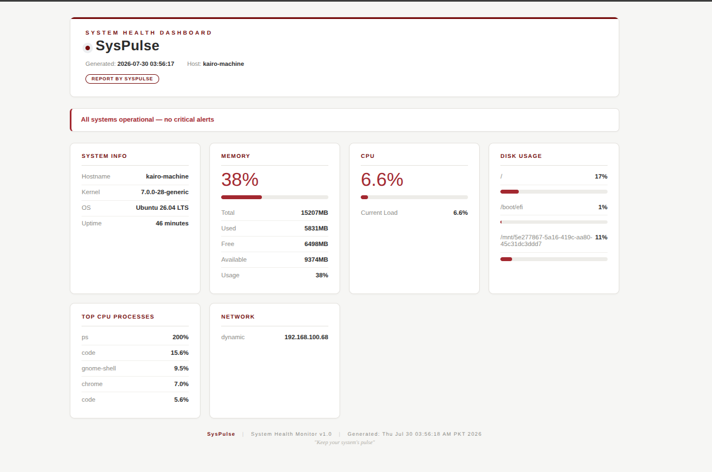

# SysPulse
>System Health Dashboard - Monitor your Linux system in real-time
```text
███████╗██╗   ██╗███████╗██████╗ ██╗   ██╗██╗     ███████╗███████╗
██╔════╝╚██╗ ██╔╝██╔════╝██╔══██╗██║   ██║██║     ██╔════╝██╔════╝
███████╗ ╚████╔╝ ███████╗██████╔╝██║   ██║██║     ███████╗█████╗  
╚════██║  ╚██╔╝  ╚════██║██╔═══╝ ██║   ██║██║     ╚════██║██╔══╝  
███████║   ██║   ███████║██║     ╚██████╔╝███████╗███████║███████╗
╚══════╝   ╚═╝   ╚══════╝╚═╝      ╚═════╝ ╚══════╝╚══════╝╚══════╝
```

[](https://opensource.org/licenses/MIT)
[](https://ubuntu.com/)
[](https://github.com/hadiakhokhar/syspulse)

---

## 🎯 What is SysPulse?

**SysPulse** is a real-time system health monitoring dashboard that tracks:

- 💾 **Memory Usage** - RAM consumption in real-time
- ⚡ **CPU Load** - Current processor usage
- 💿 **Disk Space** - Storage utilization
- 🔝 **Top Processes** - Resource-hungry applications
- 🌐 **Network Info** - Active network interfaces
- ⚠️ **Alerts** - Warning when thresholds are exceeded

---

## 🚀 Quick Start (3 Steps)

### 1️⃣ Clone & Install

```bash
git clone https://github.com/yourusername/syspulse.git
cd syspulse
chmod +x monitor.sh install.sh
./install.sh
```

### 2️⃣ View Dashboard
```bash
# Open in browser
firefox reports/dashboard_latest.html

# OR start web server
cd reports
python3 -m http.server 8080
# Open: http://localhost:8080/dashboard_latest.html
```

### 3️⃣ Run Manually (Optional)
```bash
./monitor.sh
```

## ⚙️ Configuration
Edit `monitor.sh` to customize:

```bash
# ================================================================
# CONFIGURATION
# ================================================================

SCRIPT_DIR="$(cd "$(dirname "${BASH_SOURCE[0]}")" && pwd)"

TEMPLATE_FILE="$SCRIPT_DIR/template.html"
REPORT_DIR="$SCRIPT_DIR/reports"
LOG_FILE="$REPORT_DIR/monitor.log"
ALERT_LOG="$REPORT_DIR/alerts.log"

# Alert thresholds
DISK_THRESHOLD=80      # Alert if disk > 80%
MEMORY_THRESHOLD=90    # Alert if memory > 90%
CPU_THRESHOLD=80       # Alert if CPU > 80%
```

> `monitor.sh` and `template.html` must live in the same folder — the script reads the template, fills in the live system data, and writes a timestamped report into `reports/`.

## Dashboard Preview


## 📂 Files in This Repo

```
syspulse/
├── README.md                          # Documentation with ASCII art
├── monitor.sh                        # Main monitoring script
├── template.html                      # HTML template used to render the dashboard
├── install.sh                         # One-click installer
├── uninstall.sh                       # Uninstaller
├── .gitignore                         # Git ignore
├── LICENSE                            # MIT License
└── reports/                           # Generated reports (auto-created)
    ├── dashboard_latest.html          # Always the most recent report
    ├── dashboard_YYYYMMDD_HHMMSS.html # Timestamped snapshot per run
    ├── monitor.log
    └── alerts.log
```

## 🕐 Automatic Monitoring (Cron)
After installation, SysPulse runs automatically:

```bash
# Runs every 5 minutes
*/5 * * * * /path/to/syspulse/monitor.sh
```

## Troubleshooting

### Dashboard not updating?
```bash
# Check if cron is running
sudo systemctl status cron

# View logs
tail -f reports/monitor.log
```

### Web server not starting?
```bash
# Install Python
sudo apt install python3 -y

# Start manually
cd reports
python3 -m http.server 8080
```

### Monitoring Commands
```bash
# View latest log
tail -f reports/monitor.log

# Check alerts
cat reports/alerts.log

# View dashboard
firefox reports/dashboard_latest.html

# Run manual scan
./monitor.sh
```

## 🔄 Uninstall
```bash
./uninstall.sh
```

## 📄 License

MIT License - Free to use, modify, and distribute.

---

## 🙏 Acknowledgments

- Built with ❤️ for the Linux community
- Thanks to all contributors

---

## 📧 Questions?

- GitHub Issues: [Create an issue](https://github.com/hadiakhokhar/ssh-backup-lab/issues)
- Email: workwithadia@gmail.com

---

**Made with ❤️**
